### Pipeline Usage Information for Graders
This is stepwise transfer learning pipleline, and it contains three models.
The outputs from the first two models are fused to create a more patient mutation specific dataset.
Then, Model3 uses this fused data to create a LightGM model that provides a proxy binding affinity estimations for each patient ligand pair.Our model currently takes 2 hours 45 min to run, so we created two folders for fast and slow runs.Both folders have their own Makfile and README files to guide users on how to run them.
The 7min_run folder includes our server information for usage.It builds a LightGBM proxy model using the datasets created by the previous models.The fusion datset is quite large and has 48M rows, so LightGBM uses 1M rows from it to build personalized proxy medince treatment prediction for patients with theoretically high binding probabilty.
The 3hours_run folder has the full pipeline, and README explains how to run it.Since this is an ANN model that runs on numpy arrays, even GPU usage would be slow for this run because it goes over nearmly 700,000 rows for 1800 epochs. Our previous model was based on EGFR only ANN, and it only took 15 minutes to run.However, due to circularization concerns in the fusion step, we had to expand the model's generalization across kinase proteins, so the final pipeline takes forever (2h,45min) to run.Please be careful when movin around directories, since this is a stepwise transfer learning pipeline the directory order is crucial.

# Predicting Protein–Ligand Interactions, Family, and Mutation Influence Using Multi-Modal Proxy Machine Learning

###### Tuba(Tori) Murphy, Hannah Fino, Paul Rubiro, Ana Barrera-Jauregui, Snigdha Chanduri

## Abstract 
This project presents an integrated computational framework for the prediction of small-molecule binding affinities
in Epidermal Growth Factor Receptor (EGFR) kinase mutations associated with lung adenocarcinoma. EGFR plays
an important role in cell growth and survival, and its mutations can often lead to abnormal activation and drug
resistance, making accurate binding prediction essential for the development of targeted therapy. In order to tackle
the limitations of other approaches that rely solely on protein sequence or chemical features, we combine biological,
chemical, and mutation-specific data into a unified modeling pipeline. Our hypothesis is that a multi-stage fusion
model that integrates kinase sequence features and ligand chemical properties with profiles of EGFR patient mutations
can improve the accuracy of proxy predicted binding affinity for specialized therapeutics, creating a somewhat good
framework for identifying therapeutic drug candidates for lung adenocarcinoma.
We used protein-ligand binding data from BindingDB for extracting sequence features, protein similarity mea-
surements, and ligand chemical properties. Global alignment and local alignment methods were used to improve the
feature-set, capturing both functional and structural similarities across kinase families. A fusion strategy is then applied
to integrate patient-specific EGFR mutation data with ligand and protein features to enable binding predictions for
personalized therapies. Machine learning models, including an artificial neural network for general binding affinity and
a proxy LightGBM regression for patient specific predictions, are trained and evaluated with the LightGBM model
achieving a predictive accuracy of 86%.
BindingDB Ligand Identifiers 37291, 37292, 37089, 37086, 37284, 37283, 618652, 37305, 27852, and 27853 were found
to have repeatedly more favorable proxy binding affinity predictions across patient-specific EGFR mutation profiles.
This implies that the proposed proxy binding model could act as a screening system to help identify ideal candidates
for further chemotherapeutic scaffold improvements. Benzothiophene phenol analogs, thienopyrimidine kinase inhibitor
analogs and genistein derivatives may present promising future directions in therapeutic development for EGFR-driven
lung cancer.

## Project Design 
This is a multi-stage feature engineering and transfer learning pipeline where each checkpoint builds on the results of
the previous one (Alpsoy and Sezerman, 2025). The output of one step becomes the input of the next, expanding
from molecular features to chemical context to patient level prediction, with sanity checks at every step before moving
forward. Checkpoint 1 has four steps. It downloads BindingDB kinase and ligand data, builds Needleman−Wunsch global
sequence alignment features, and combines the protein and chemical features into a singular dataset. Finally, it trains
a neural network regression model to calculate EGFR binding affinity and executing molecular prediction (log affinity and
logP) scores. Checkpoint 2 step 1 and step 2 build on the checkpoint 1 protein sequences using composition features and
BLOSUM62-inspired embeddings. Checkpoint 2 step 3 enhances the feature set further via adding Smith−Waterman
alignment for sequence representation. Checkpoint 2 step 4 trains a classification model for predicting kinase family using
the integrated dataset. Checkpoint 3 constructs a combined dataset by fusing EGFR patient mutation profiles (Exon
19 del, L858R, L861Q, G719X and Exon 20 mutations) with the checkpoint 1 ANN-based ligand binding estimations
and checkpoint 2 EGFR family classification outputs. LightGBM model is used with the fusion dataset to compute
personalized drug response for each patient and ligand pair, putting together molecular and biological signals into patient
level therapeutic insights.

# Checkpoint-1
Chuckpoint 1 creates the a baseline for full pipeline for predicting protein ligand binding affinity.It starts by loading and filtering the dataset to only include kinase proteins.Then, protein and ligand features are generated separately.Finally, these features are combined into a ANN machine learning model and evaluated EGFR setup and binding analysis. 

## Checkpoint-1  Step-1 
Checkpoint-1 step1 downloads the full BindingDB dataset, which contains protein ligand ineractions data for many types of proteins and then filters it to keep only kinase related entries.Data gets loaded in smaller chunks so it doesn't overload ram.It cleans the data, selects important columns,convets binding values into usable format, and filters the dataset to keep only kinase related rows while marking EGFR for later testing.Finally, it combines all the prepared data and saves a clean kinase specific datset that will be used i the next steps for the project.Sanity checks were completed for nan values, missing columns, and terminal outputs were saved in images.

    
    
    •python cp1_step_1.py 

    Data Directory:New_checkpoint_1_data_here
    File saved:
    checkpoint_1_step_1_kinase_filtered_data.csv

#### checkpoint_1_step_1_kinase_filtered_data.csv has 697,865 actual data rows.

## Checkpoint-1  Step-2 
Checkpoint-1 Step-2 takes the cleaned kinase data from step-1 <checkpoint_1_step_1_kinase_filtered_data.csv> and compares each protein sequence to reference kinase family sequences using Needleman Wunsh allignment to evaluate similairty. It calculates features like allignment score,normalized similarity, and closest kinase family for each protein.The output is a new dataset with these sequence based features added which will be used for machine learning in Checkpoint-1 step3 and checkpoint-2 step1.

    python cp1_step_2.py 
    Data Directory:New_checkpoint_1_data_here
    File saved:()
    checkpoint_1_step_2_alignment_features_data.csv
    checkpoint_1_kinase_reference_sequence_data.csv

## Checkpoint-1  Step-3
Checkpoint-1 step-3 takes dataset from step2 <checkpoint_1_step_2_alignment_features_data.csv> and converts SMILES strings into numerical features like molecular fingerprints and chemical properties ie.molecular weight, hydrophobicity.This crucial beacuse machine learning models cannot use raw SMILES strings, so we transform them into numbers that provides ligand structure and behavior.
These ligand features are then combined with protein similarity features to create a final dataset that allows the model to learn and predict protein ligand binding affinity.

    •python cp1_step_3.py  
    Data Directory:New_checkpoint_1_data_here
    File saved:
    checkpoint_1_step_3_No_smiles_spam_feature_table_data.csv

Data structure is correct, features complete,values are realistic,missining values minimal(1%) pipeline seems like working perfectly.

## Checkpoint-1  Step-4
This code takes the final dataset from step3 <checkpoint_1_step_3_No_smiles_spam_feature_table_data.csv>
cleans and prepares features, and trains an ANN model to predict binding affinity across kinase proteins while evaluating how well the model generalizes across kinase families while mainitaing EGFR related prediction performance.The ANN model was trained on 574,440 total kinase protein rows, including 24,652 EGFR rows, where EGFR samples in the trainning set were oversampled from 15,646 to 31,292 rows to improve EGFR realted learning while still maintaining generalization across kinase families.The final model achieved validation R^2 score of 0.614, a test R^2 score of 0.601, ans test RMSE of 0.9215, and the ouput inlcudes EGFR predictions, feature importance scores, and saved files for the trained model and scaler.

    •nohup python -u  cp1_step_4.py > cp1_step_2_for_run.log 2>&1 &
    OR
    •python cp1_step_4.py
    Data Directory:New_checkpoint_1_data_here
    File Saved:
    ckp1_step4_model_1_egfr_weights.pkl
    ckp1_step4_model_1_egfr_weights_scaler.pkl
    ckp1_step4_model_1_egfr_weights_y_scaler.pkl

    Some Addition Visual Outputs:
   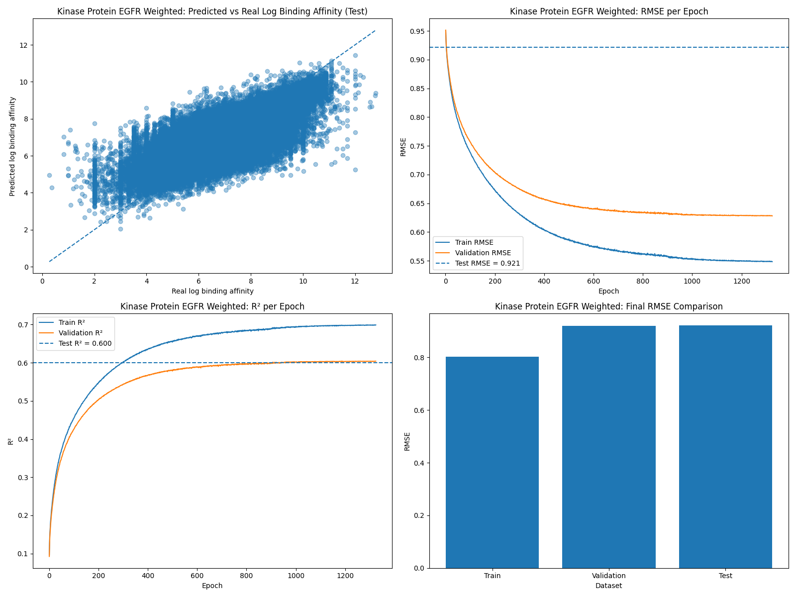

# Checkpoint-2 

## Checkpoint-2 Step-1
The first step in the Checkpoint 2 pipeline addresses the fundamental challenge of representing protein sequences as numerical features suitable for machine learning algorithms. Protein sequences, expressed as strings of amino acid letters, must be transformed into quantitative representations that capture biologically relevant properties. This transformation is essential because machine learning models cannot directly process raw sequence data; they require numerical input vectors with consistent dimensionality across all samples.

The sequence feature extraction process operates on the output from Checkpoint 1 Step 2, which contains protein sequences aligned against kinase family references along with their corresponding target names and alignment scores. The primary objective is to extract a comprehensive set of features that characterize each protein sequence from multiple perspectives: its amino acid composition, its physicochemical properties, and its structural characteristics. These features collectively provide a multi-faceted representation of each protein that enables downstream classification algorithms to distinguish between different kinase families.

**To run the file (Paul_Rubiro_Checkpoint_2_Step_1):** 
``
nohup python -u  cp2_step_1.py. > cp2_step1_run.log 2>&1 &
``

**Output:** 
Checkpoint_2_data/checkpoint_2_step_1_sequence_feature_data.csv

**Log File Output:**
- Number of sequences processed
- Count of unique sequences identified
- Confirmation of successful output file creation
- Final dataframe shape

## Checkpoint-2  Step-2
The second step extends the feature extraction process by generating deep sequence embeddings that capture more nuanced patterns within protein sequences. While the composition based features from Step 1 provide valuable information about the overall character of a protein, they do not account for the sequential arrangement of amino acids or position dependent patterns that often carry functional significance. The embedding approach addresses this limitation by encoding each amino acid as a multi-dimensional vector and aggregating these vectors in ways that preserve positional information.

**To run the file:** 
``nohup python -u cp2_step_2.py > cp2_step_2_run.log 2>&1 &``

**Output:** 
Checkpoint_2_data/checkpoint_2_step_2_deepseq_embedding.csv

**Log File Output:**
- Number of unique sequences to embed
- Progress bar for embedding generation
- Confirmation of output file saved
- Final dataframe shape

## Checkpoint-2  Step-3
Checkpoint-2 Step 3 takes the dataset produced from the previous step <checkpoint_2_step_2_deepseq_embedding.csv> and prepares it for protein classification processes. The goal of this step is to create a clean, protein-level feature table that can be used for machine learning while also visualizing relationships between proteins and combining local alignment features using Smith-Waterman.
First, data is cleaned via removing rows with missing or invalid kinase family labels and standardizing the label formatting. Then, non-feature columns such as identifiers, sequences, and raw metadata are removed so that there are only numerical features remaining. Functions were produced to help determine local alignment features to combine with the global alignment and other features summarized through checkpoints 1 and checkpoint 2 thus far. Once local alignment features are created and added to the dataset, all feature columns are converted to numeric values, and missing or infinite values are handled in order to ensure compatibility with machine learning models. The resulting dataframe is saved for step 3. The rest of step 3 was used to produce some visualizations using dendograms for family and protein subsets, where a protein is being represented by a single row, helping to prevent any over-convolution in the visualization data. After building the final protein-level dataset, a dendrogram (hierarchical clustering tree) is generated using Euclidean distance and Ward linkage. The visualization helps to show how proteins might cluster based on their sequeunce-derived and embedding featurrs. This would provide more insight into protein family relationships.
The final output is a cleaned dataset now considering local alignments along with the saved visualization of protein clusters, which will be used as input for Step 4.

    •nohup python -u  cp2_step_3.py> cp2_step3_run.log 2>&1 & 
    OR
    •python checkpoint_2_step_3.py

    Data Directory: Checkpoint_2_data
    Files saved:
    checkpoint_2_step_3_family_classification.csv
    checkpoint_2_step_3_family_tree_plot.png
    checkpoint_2_step_3_protein_subset.png
### Terminal General Sanity Check

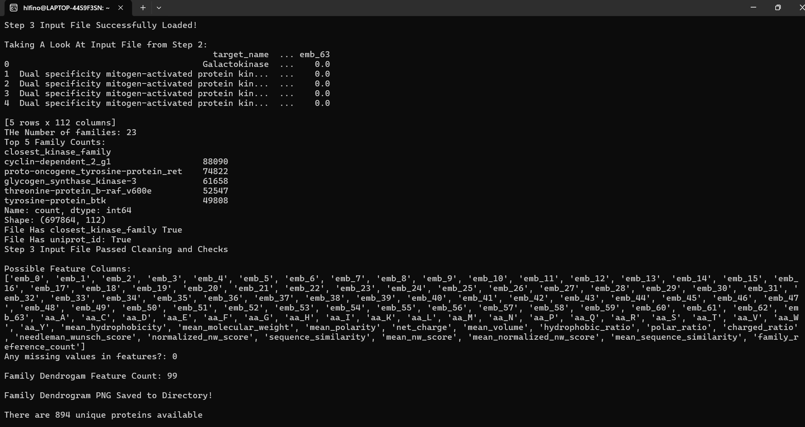
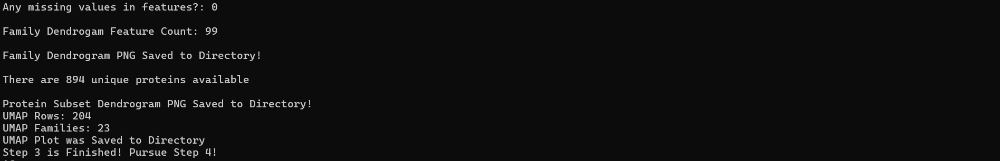

The terminal sanity checks show the proper loading of the input dataset to step 3, as well as showing setup and inspection visually throughout the step 3 proceess. It confirms moves to each step, as well as dataframe sizes and feature presence.

### Visual Outputs for Step 3

Within checkpoint 2 step 3, visualization methods were adapted to understand the family classification more visually, as well as experimenting with some basic EDA for understanding. Dendrogram plots were made for families and for protein subsets (though protein subset plot is convoluted and hard to read, but still posted here). UMAP was also experimented with, but from experimentation the conclusion was drawn that the family classifiers do not separate well in feature space, seen by poor separation on UMAP plotting.

## Checkpoint-2  Step-4
Checkpoint-2 Step 4 trains a machine learning model to predict the protein kinase family using the dataset generated in step 3 <checkpoint_2_step_3_family_classification.csv>. This step focuses on evaluating how well the model can generalize to unseen proteins.
The dataset is first loaded and validated to make sure that the necessary information is present from the step 3 output, such as required labels and features. 
Feature columns are separated from the metadata, and all of the values are converted to numeric format with missing values handled appropriately. The target variable, kinase family, is encoded into numerical labels for model training. A XGBoost Classifier is trained using class-balanced weighting to account for a vast difference in family sizes and the model then predicts protein family labels on the unseen test set of EGFR prteins. Model performance is being evaluated using Accuracy, Macro F1 Score, Weighted F1 Score, and a Confusion Matrix.
Additional visualizations have been generated to help better understand the behavior of the mode;. This includes the following:
Confusion Matrix (saved as PNG)
Feature Importance Plot (top 20-30 contributing features)
Performance Metrics Bar Chart
Prediction Correctness Breakdown
Prediction Confidence Distribution

These outputs are able to help analyze the features that are contributing to classification while also showing how well the model is generalizing under the protein-holdout conditions.

    •nohup python -u  cp2_step_4.py > cp2_step4_run.log 2>&1 & 
    OR
    •python checkpoint_2_step_4.py

    Data Directory: Checkpoint_2_data
    Files saved:
    checkpoint_2_step_4_transfer_learning_family_predictions.csv
    checkpoint_2_step_4_family_classification_metrics.csv
    checkpoint_2_step_4_family_classification_confusion_matrix.csv
    checkpoint_2_step_4_feature_importance.csv

    Some Addition Visual Outputs:
    checkpoint_2_step_4_confusion_matrix.png
    checkpoint_2_step_4_feature_importance.png
    checkpoint_2_step_4_metrics.png
    checkpoint_2_step_4_cvsi.png
    checkpoint_2_step_4_conhist.png

### Terminal General Sanity Check

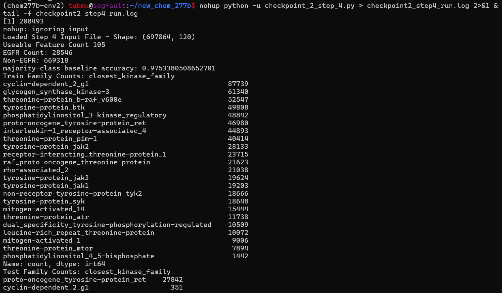
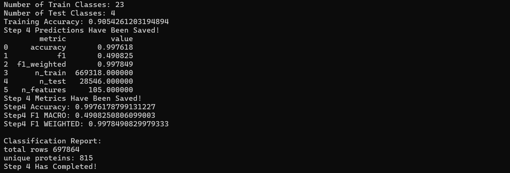

### Visualization Outputs for Model Performance Monitoring
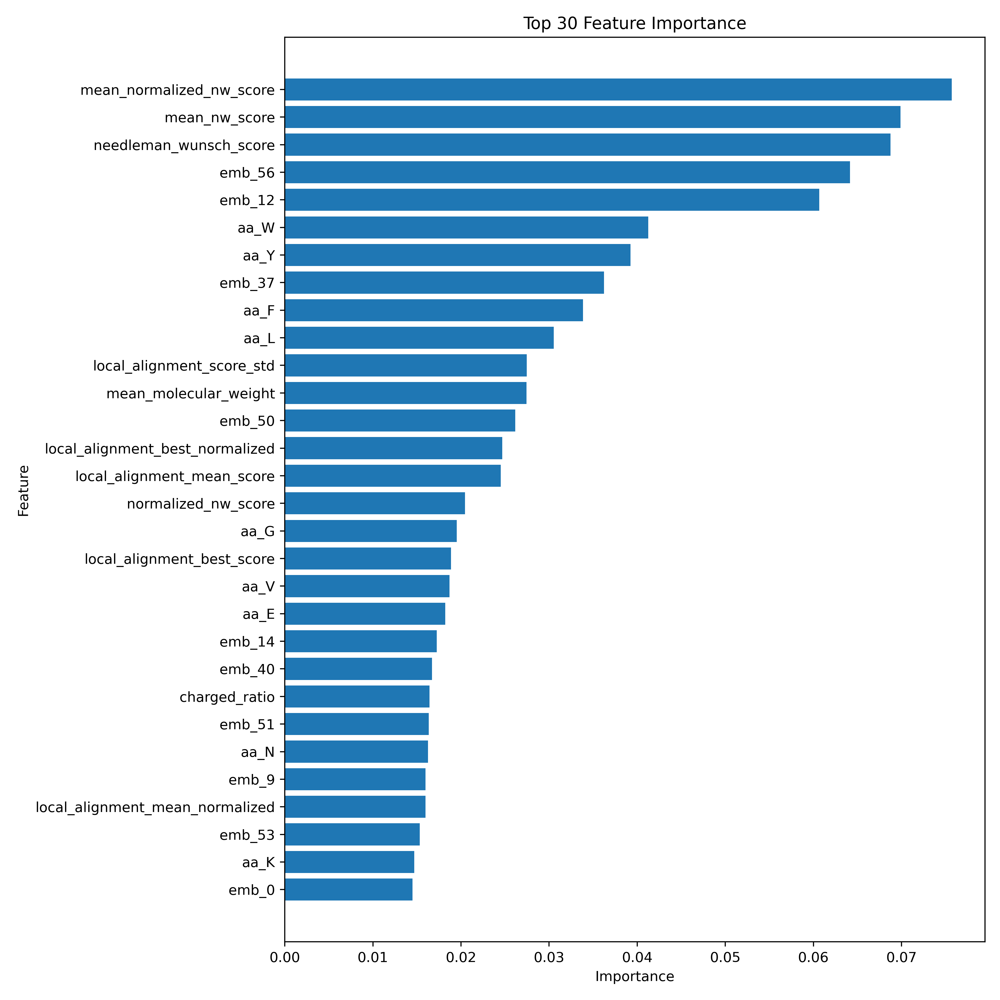
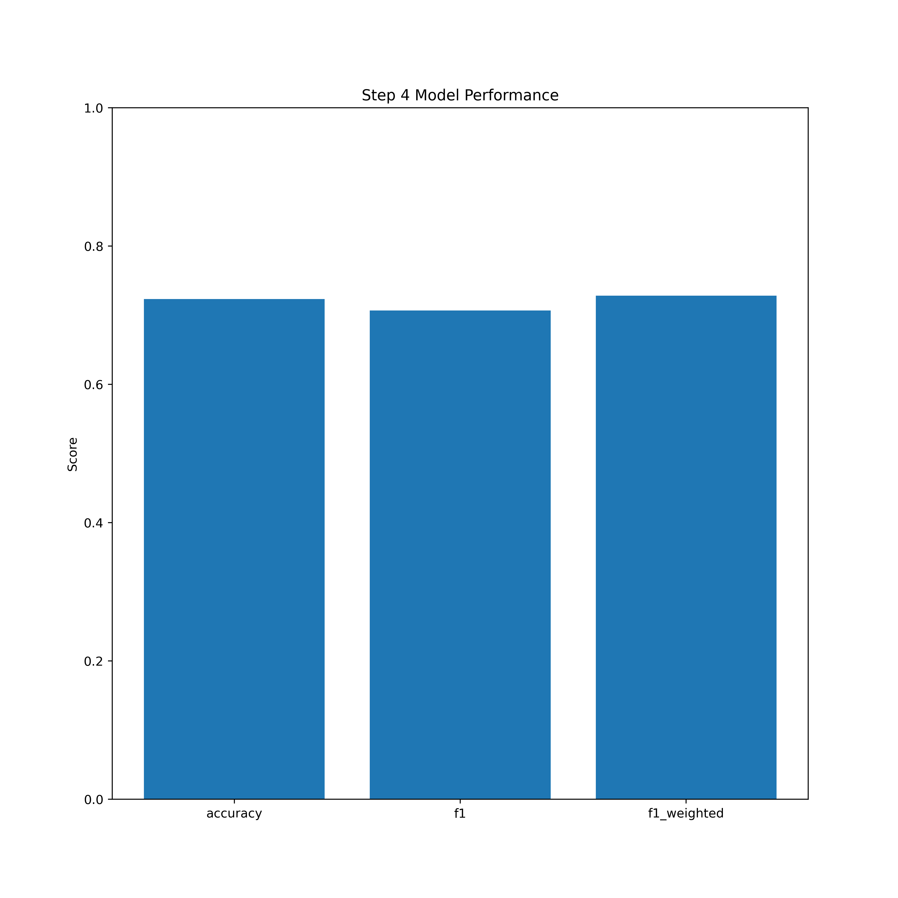
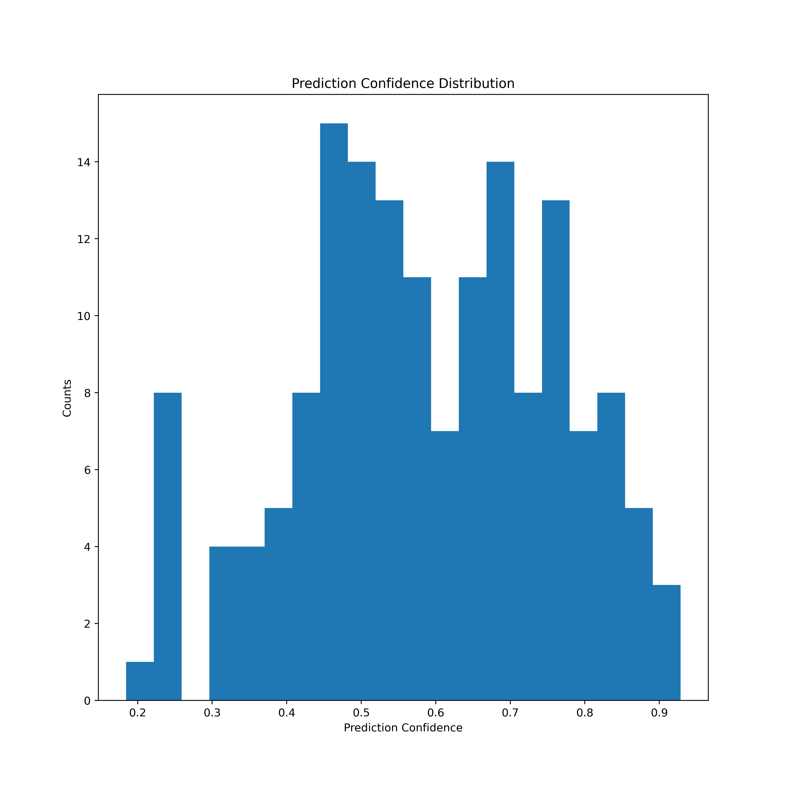
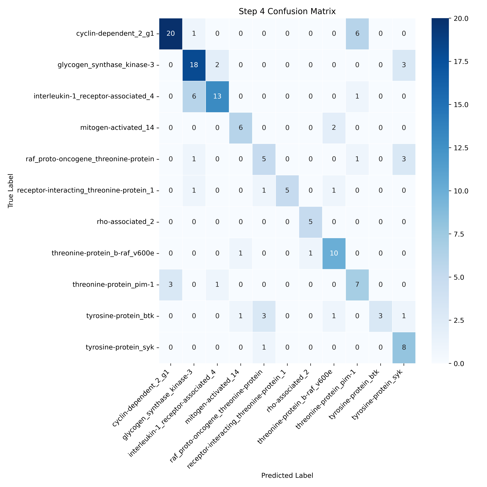
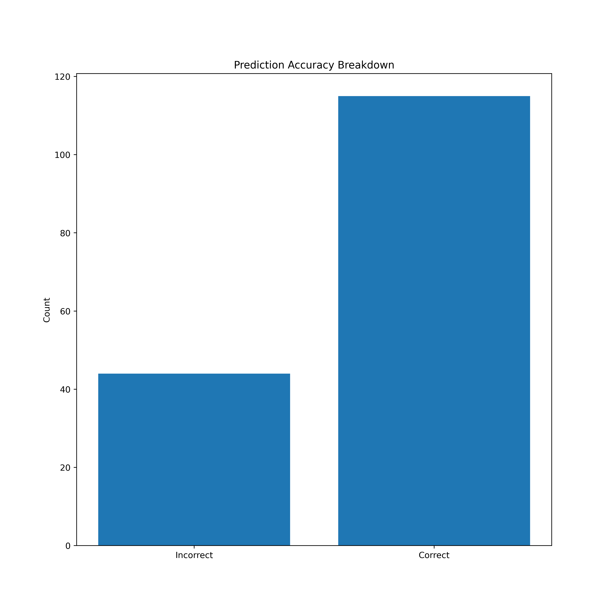

These plots, and other print statements and confusion matrices are being used to evaluate how the model is responding to the protein-holdout goal with different hyperparameters and data distributions. Due to the lower testing accuracy and overly high accuracy, the next step would be to work on the moderate overfitting occuring with this model, as well as investigate different ways of handing the protein-holdout or protein representations. This model was able to achieve consistent F1 scoring betwee Macro and Weighted, suggesting that weighting the samples and eliminating under-represented groups were key for balancing the metrics. Working on generalizing the model to under-represented proteins would also be the future direction once overfitting was eliminated.

# Checkpoint -3 
## Checkpoint-3 Step-1
### Patient Mutation Dataset Construction

By structing the data at the patient level and encoding mutation presence as features, this step establishes a bridge between traditional molecular modelings and personalized medicine. 

The dataset captured key EGFR mutation types commonly associated with cancer progression and therapeutic response: exon 19, L858R, L861Q, and G719X. Rather than treating EGFR as a uniform target, our dataset could reflect how its behavior varies across individuals, enabling downstream models to incorporate patient-specific biological context for lung adenocarcinoma. The mutation dataset consists of approximately 70 patients, each annotated with EGFR mutation information. 

The data was obtained from the Cancer Genome Altas Program (TCGA) compared with ChemBL to include mutation labels, hotspot indicators, and associated mutation metadata.
| Feature | Description |
|--------|------------|
| `patient_id` | Unique identifier for each patient |
| `has_exon19del` | Exon 19 deletion mutation indicator (0/1) |
| `has_L858R` | L858R substitution mutation (0/1) |
| `has_L861Q` | L861Q mutation (0/1) |
| `has_G719X` | G719X mutation (0/1) |
| `has_exon20_alteration` | Exon 20 alteration indicator (0/1) |
| `mutation_count` | Number of mutations per patient |
| `is_compound_mutation` | 1 if multiple mutations are present |
| `is_egfr_hotspot` | Indicates hotspot mutation presence |

---

The masterdata.ipynb notebook serves as the central data integration and preprocessing stage for the EGFR personalized drug-response modeling pipeline. In this step, multiple biological and chemical datasets were consolidated into a unified machine-learning-ready framework. Patient-derived molecular data from CPTAC and TCGA were combined with ligand activity and structural information collected from ChEMBL in order to model how EGFR mutation environments may influence inhibitor binding behavior. The notebook organizes mutation profiles, RNA expression, protein abundance, phosphoproteomic signaling activity, and ligand descriptors into a consistent format that can later be used for predictive modeling.

To achieve this, several data cleaning and normalization procedures were applied across the different sources. TCGA mutation records were parsed and converted into structured mutation features, while CPTAC protein, RNA, and phosphosite datasets were reshaped and standardized to allow patient-level comparisons. Duplicate patient identifiers were removed, missing values were filtered, and mutation categories were encoded into machine-readable representations. On the chemical side, ligand binding records and SMILES-derived molecular descriptors were cleaned and merged to preserve biologically relevant drug information. These steps ensured compatibility between datasets originating from different experimental platforms and repositories.

A major objective of the notebook was constructing the patient_ligand.csv dataset, which acts as the bridge between biological patient information and ligand chemistry. This fused dataset pairs patient-specific EGFR mutation features with ligand molecular descriptors and estimated binding behavior, enabling downstream machine learning models to learn relationships between mutation environments and drug response. By integrating both biological variability and chemical variability into a single table, the pipeline moves beyond traditional ligand-only prediction approaches and toward a simplified representation of personalized medicine workflows.

The final outputs generated from this notebook were designed specifically for downstream regression modeling using LightGBM. After feature engineering and dataset fusion, the resulting master datasets were cleaned, standardized, and exported into modeling-ready CSV files. These outputs were later used to train predictive models capable of estimating log binding affinity and evaluating how mutation-driven biological context may alter inhibitor interactions with EGFR.

## Checkpoint -3 Step-2
### Fusion Step 
This code loads and cleans patient mutation data together with kinase ligand feature data, then uses the pretrained ANN model1 to generate proxy binding afinity predictions for kinase related ligands.The ANN x_scaler normalizes all numerical input features before prediction, while the y_scaler converts ANN ouput values back into original binding affinity score ranges for easier biological meaning.

Next, the code merges patient mutation profiles with ligand feature tables 
by using a Cartesain join, which creates every possible patient ligand combination for personalized predictiom modeling.Additional interaction features are thrn generated between ANN predicted binding afinity scores and EGFR realted mutation variables to preapre the final fusion dataset for downstream LightGBM modeling.

         •nohup python -u  cp3_step_2.py > cp3_step2_run.log 2>&1 & 
         OR
        •python cp3_step_2.py

        Data Directory: Checkpoint_3_data
        Files saved:

        checkpoint3_patient_clean.parquet
        checkpoint1_kinase_weighted_feature_table.parquet
        checkpoint2_predictions_clean.parquet
        checkpoint3_fusion_lightgbm_ready.parquet

## Checkpoint-3 Step-3
### LightGBM 

Two LightGBM regression models were compared to evaluate whether ligand chemistry improved EGFR binding affinity prediction. The baseline model used only mutation-derived and patient molecular features, while the second model incorporated ligand descriptors derived from ChEMBL SMILES structures, including molecular weight, LogP, hydrogen bond features, and molecular fingerprints.
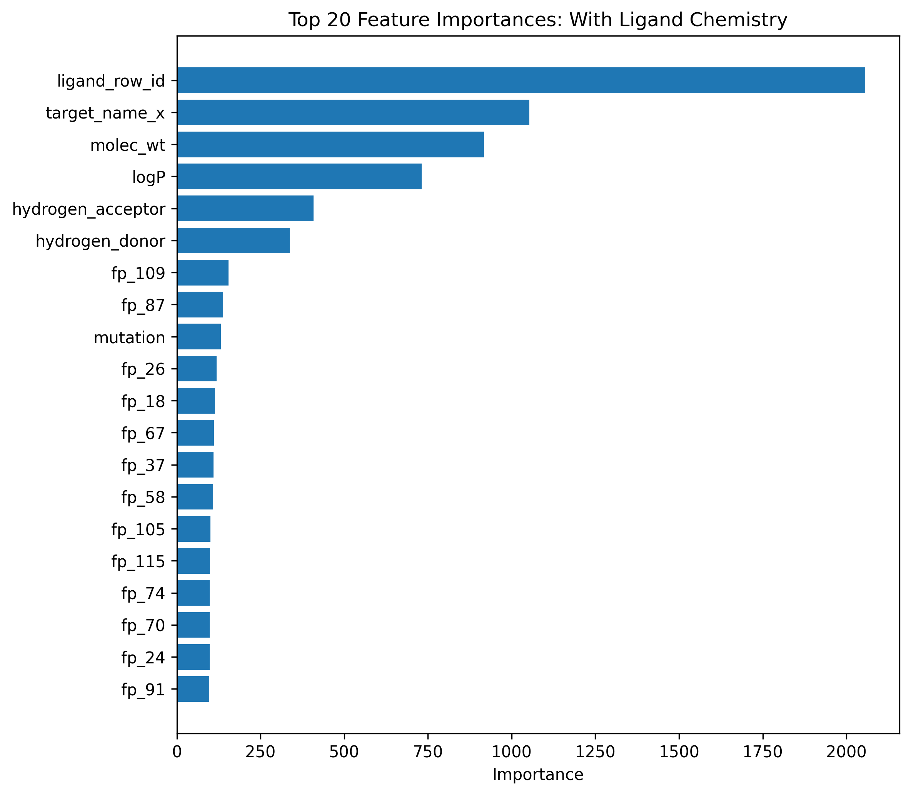

When ligand chemistry was included, the predictions clustered more tightly around the diagonal line, indicating improved agreement between predicted and true binding affinities. In contrast, the model without ligand chemistry showed greater spread and deviation from the ideal prediction line, particularly at lower and higher affinity ranges. This suggests that incorporating molecular descriptors helped the model better capture chemical factors influencing EGFR inhibitor interactions.
          •nohup python -u  cp3_step_3.py > cp3_step3_run.log 2>&1 & 
           OR
         •python cp3_step_3.py

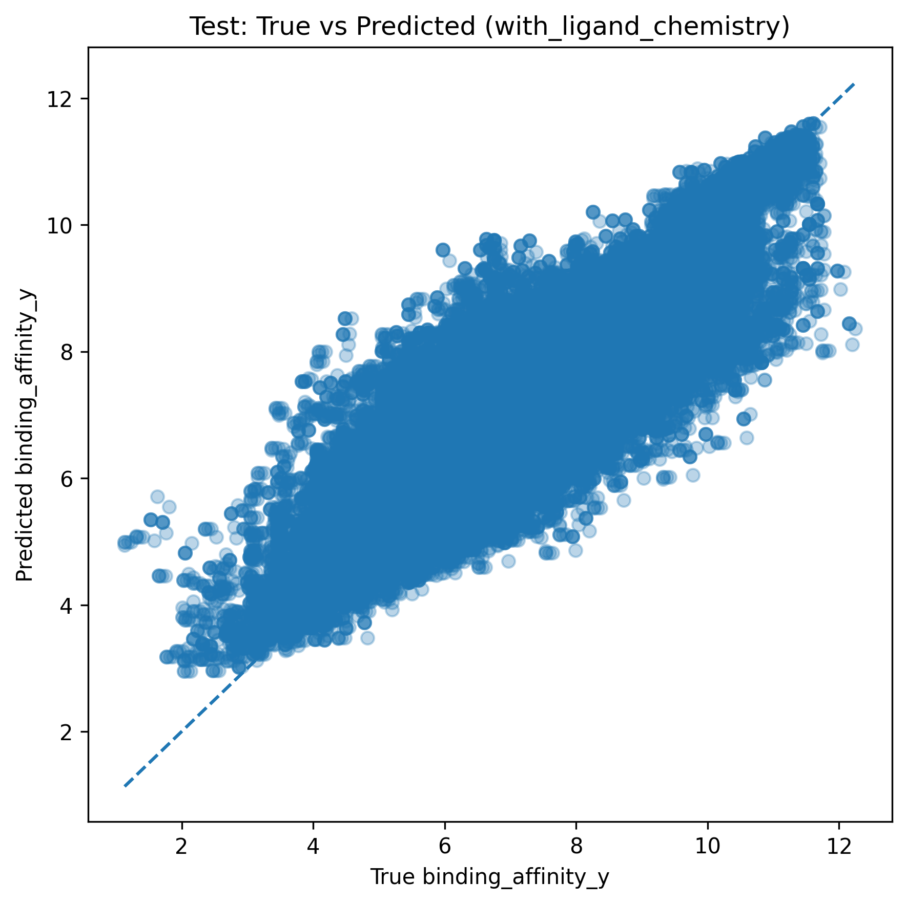
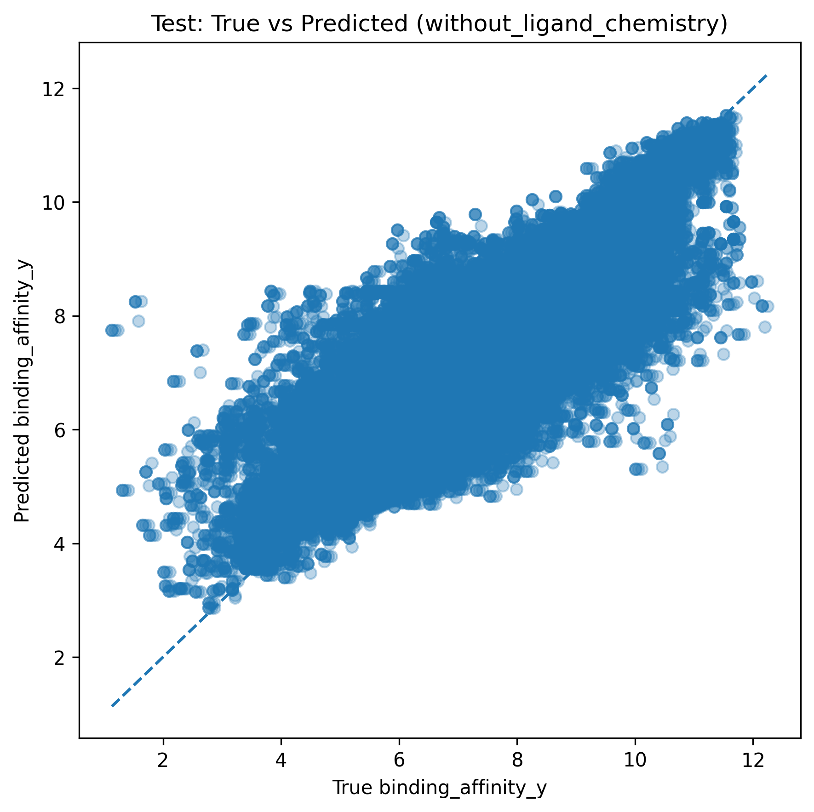
