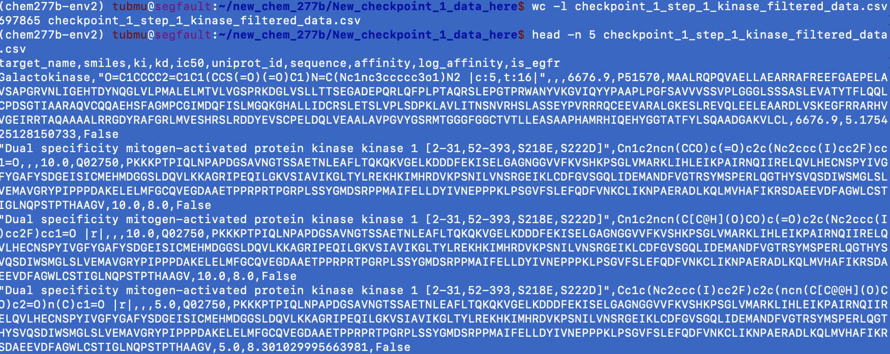
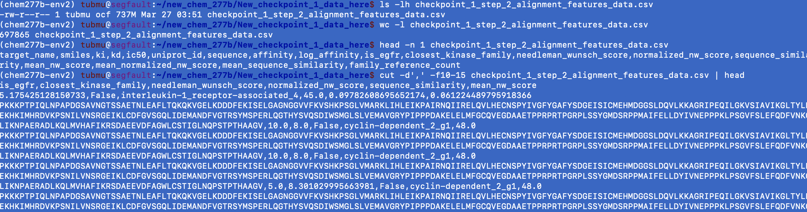
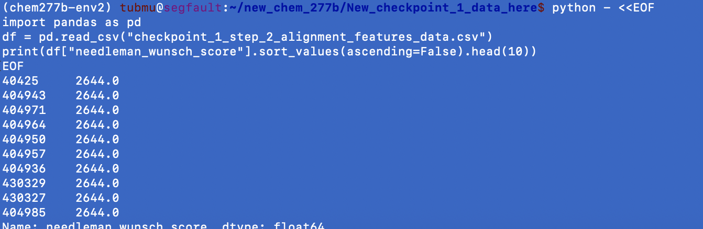
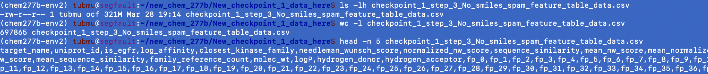
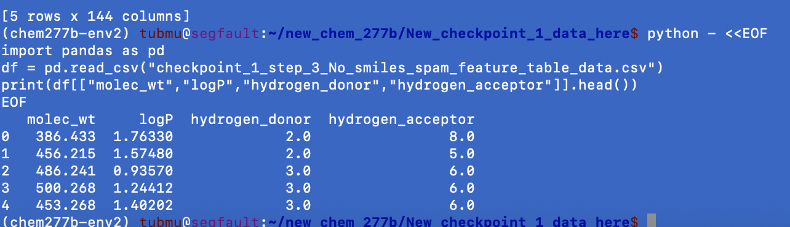
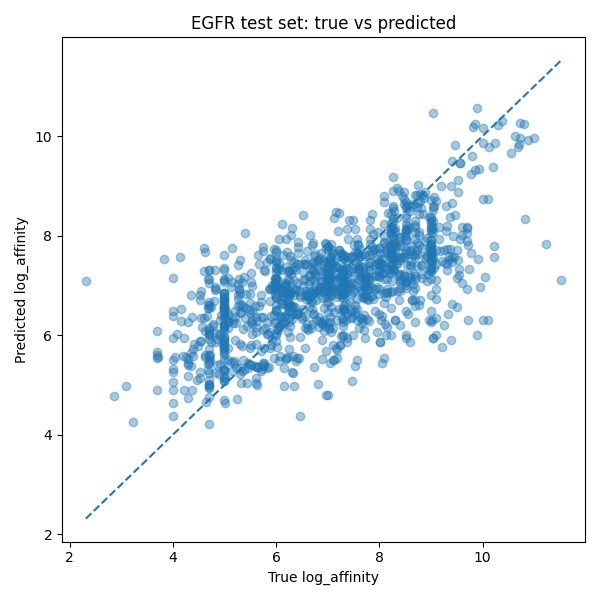
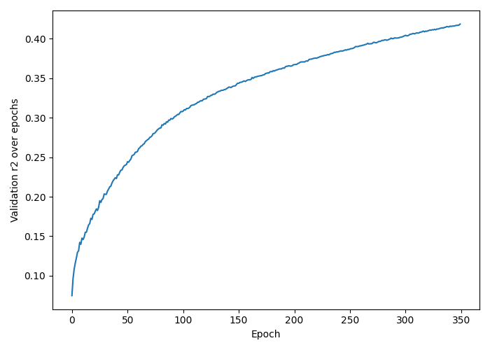

# Predicting Protein Ligand Ineractions, Family, and Environmental Influence Using Fusion Based Machine Learning Model

This project focuses on predicting ineractions between kinase family proteins by analyzing their sequence similarity, kinase ligand ineractions, and how these ineractions change under different environmental conditions.Kinase family proteins play a crucial role in cell signalling, regulating  growth and their dysregulation is heavily linked to several types of cancer.Unfortunately,current public datasets often lack integrated approaches that account for tissue specific conditions.As a result, they do not fully capture whether a kinase would bind to a ligand in a specific bilogical context.Our approach constructs on these datasets by integrating protein ligand, and enviromental information into a single model to better reflect real world conditions and support more personalized medicine applications.
Currently, the project emphasizes kinase proteins and introduces a cold start problem where the model must predict binding for protein it has never seen before.To test this, we exclude EGFR from training and use it only for evalution.
Protein features include sequence similairty using Needleman-Wunsch and Smith Waterman motif detection methods.Ligand features are generated from SMILES strings and include properties like hydrophobicity and binding affintiy.These features are combined into a multi modal machine learning model.The projects is divided into three checkpoints:binding predictions, protein family classifcation, and enviromental efects.In the final phase we include factors like pH and tissue specific conditions to better understand how context affects binding.The model ouputs similarity scores,binding affinity,and critical contributing environmental features.
We are going to use datasets such as BindingDB,UniProt,Protein Databank, and ChemBL across different checkpoints.Our aim is to improve prediction accuracy for unseen kinase proteins by combining biological, chemical and environmental information into a unified framework to create more personalized therapeutics.The model developed in `Checkpoint 1 and 2 will be integrated into a fusion model` to allow personalized medicine strategies for EGFR mutant lung adenocarcinoma.

## Server Usage Info
•To access the server 

    ssh tubmu@hpcctl.ocf.berkeley.edu
•Password

    group8chem277B@ucb
•Activate Environment

    source chem277b-env2/bin/activate
•python file folder

     cd new_chem_277b
•Project output folder

    cd New_checkpoint_1_data_here Or
    cd Checkpoint_2_data
•To get out of the server
   
    exit

# Checkpoint-1
Chuckpoint 1 creates the full pipeline for predicting protein ligand binding affinity.It starts by loading and filtering the dataset to only include kinase proteins.Then, protein and ligand features are generated separately.Finally, these features are combined into a machine learning model and evaluated using a cold start setup where EGFR is not inlcuded during training.

## Checkpoint-1  Step-1 
Checkpoint-1 step1 downloads the full BindingDB dataset, which contains protein ligand ineractions data for many types of proteins and then filters it to keep only kinase related entries.Data gets loaded in smaller chunks so it doesn't overload ram.It cleans the data, selects important columns,convets binding values into usable format, and filters the dataset to keep only kinase related rows while marking EGFR for later testing.Finally, it combines all the prepared data and saves a clean kinase specific datset that will be used i the next steps for the project.

    
    •nohup python -u TSM_Upt_checkpoint_1_step_1_gitcopy.py > cp1_step_1_for_run.log 2>&1 & 
    OR
    •python TSM_Upt_checkpoint_1_step_1_gitcopy.py 

    Data Directory:New_checkpoint_1_data_here
    File saved:
    checkpoint_1_step_1_kinase_filtered_data.csv

### Terminal General Sanity Check

#### checkpoint_1_step_1_kinase_filtered_data.csv has 697,865 actual data rows.

## Checkpoint-1  Step-2 
Checkpoint-1 Step-2 takes the cleaned kinase data from step-1 <checkpoint_1_step_1_kinase_filtered_data.csv> and compares each protein sequence to reference kinase family sequences using Needleman Wunsh allignment to evaluate similairty. It calculates features like allignment score,normalized similarity, and closest kinase family for each protein.The output is a new dataset with these sequence based features added which will be used for machine learning in Checkpoint-1 step3 and checkpoint-2 step1.

    •nohup python -u TSMchckp1_step_2.py > cp1_step_2_for_run.log 2>&1 &
    OR
    python TSMchckp1_step_2.py 
    Data Directory:New_checkpoint_1_data_here
    File saved:()
    checkpoint_1_step_2_alignment_features_data.csv
    checkpoint_1_kinase_reference_sequence_data.csv

### Terminal General Sanity Check

## Checkpoint-1  Step-3
Checkpoint-1 step-3 takes dataset from step2 <checkpoint_1_step_2_alignment_features_data.csv> and converts SMILES strings into numerical features like molecular fingerprints and chemical properties ie.molecular weight, hydrophobicity.This crucial beacuse machine learning models cannot use raw SMILES strings, so we transform them into numbers that provides ligand structure and behavior.
These ligand features are then combined with protein similarity features to create a final dataset that allows the model to learn and predict protein ligand binding affinity.

    •nohup python -u TSM_chckp1_step_3_mef_smiles-spam-off.py > cp1_step_2_for_run.log 2>&1 &
    OR
    •python TSM_chckp1_step_3_mef_smiles-spam-off.py 
    Data Directory:New_checkpoint_1_data_here
    File saved:
    checkpoint_1_step_3_No_smiles_spam_feature_table_data.csv

### Terminal General Sanity Check

Data structure is correct, features complete,values are realistic,missining values minimal(1%) pipeline seems like working perfectly.

## Checkpoint-1  Step-4
This code takes the final dataset from step3 <checkpoint_1_step_3_No_smiles_spam_feature_table_data.csv>
cleans and prepares all features, and trains a ANN model to predict binding affinity.It trains the model only on non-EGFR proteins and then tests it on EGFR to evaluate how well it generalizes to unseen data.The output includes predictions for EGFR, feature importance scores, and saved files for the trained model and scaler.

    •nohup python -u  Tuba_Murphy_updated_checkpoint_1_step4.py > cp1_step_2_for_run.log 2>&1 &
    OR
    •python Tuba_Murphy_updated_checkpoint_1_step4.py
    Data Directory:New_checkpoint_1_data_here
    File saved:
    checkpoint_1_scaler_data.pkl
    checkpoint_1_egfr_predictions_data.csv
    checkpoint_1_feature_importance_data.csv

    
    
=======
### Terminal General Sanity Check

# Checkpoint-2 

## Checkpoint-2 Step-1
The first step in the Checkpoint 2 pipeline addresses the fundamental challenge of representing protein sequences as numerical features suitable for machine learning algorithms. Protein sequences, expressed as strings of amino acid letters, must be transformed into quantitative representations that capture biologically relevant properties. This transformation is essential because machine learning models cannot directly process raw sequence data; they require numerical input vectors with consistent dimensionality across all samples.

The sequence feature extraction process operates on the output from Checkpoint 1 Step 2, which contains protein sequences aligned against kinase family references along with their corresponding target names and alignment scores. The primary objective is to extract a comprehensive set of features that characterize each protein sequence from multiple perspectives: its amino acid composition, its physicochemical properties, and its structural characteristics. These features collectively provide a multi-faceted representation of each protein that enables downstream classification algorithms to distinguish between different kinase families.

**To run the file (Paul_Rubiro_Checkpoint_2_Step_1):**
``
nohup python -u Paul_Rubiro_checkpoint_2_step_1.py > checkpoint2_step1_run.log 2>&1 &
``
**Output:**
Checkpoint_2_data/checkpoint_2_step_1_sequence_feature_data.csv

**Log File Output:**
- Number of sequences processed
- Count of unique sequences identified
- Confirmation of successful output file creation
- Final dataframe shape

## Checkpoint-2  Step-2
The second step extends the feature extraction process by generating deep sequence embeddings that capture more nuanced patterns within protein sequences. While the composition based features from Step 1 provide valuable information about the overall character of a protein, they do not account for the sequential arrangement of amino acids or position dependent patterns that often carry functional significance. The embedding approach addresses this limitation by encoding each amino acid as a multi-dimensional vector and aggregating these vectors in ways that preserve positional information.

**To run the file:**
``nohup python -u Paul_Rubiro_checkpoint_2_step_2.py > checkpoint2_step2_run.log 2>&1 &``

**Output:**
Checkpoint_2_data/checkpoint_2_step_2_deepseq_embedding.csv

**Log File Output:**
- Number of unique sequences to embed
- Progress bar for embedding generation
- Confirmation of output file saved
- Final dataframe shape

## Checkpoint-1  Step-3
Checkpoint-2 Step 3 takes the dataset produced from the previous step <checkpoint_2_step_2_deepseq_embedding.csv> and prepares it for protein classification processes. The goal of this step is to create a clean, protein-level feature table that can be used for machine learning while also visualizing relationships between proteins.
First, data is cleaned via removing rows with missing or invalid kinase family labels and standardizing the label formatting. Then, non-feature columns such as identifiers, sequences, and raw metadata are removed so that there are only numerical features remaining.
All feature columns are converted to numeric values, and missing or infinite values are handled in order to ensure compatibility with machine learning models. Next, duplicate protein entries are collapsed by grouping on identifiers such as UniProt ID and kinase family. This also ensures that each protein is being represented by a single row, helping to prevent any biase caused by a ligand having repeated entries.
Adter building the final protein-level dataset, a dendrogram (hierarchical clustering tree) is generated using Euclidean distance and Ward linkage. The visualization helps to show how proteins might cluster based on their sequeunce-derived and embedding featurrs. This would provide more insight into protein family relationships.
The final output is a cleaned and reduced dataset along with the saved visualization of protein clusters, which will be used as input for Step 4

    •nohup python -u checkpoint_2_step_3.py > checkpoinr2_step3_run.log 2>&1 & 
    OR
    •python checkpoint_2_step_3.py

    Data Directory: Checkpoint_2_data
    File saved:
    checkpoint_2_step_3_family_classification.csv
    checkpoint_2_step_3_family_tree.png
### Terminal General Sanity Check

## Checkpoint-1  Step-4
Checkpoint-2 Step 4 trains a machine learning model to predict the protein kinase family using the dataset generated in step 3 <checkpoint_2_step_3_family_classification.csv>. This step feocuses on evaluating how well the model can generalize to unseen proteins in a cold-start setting.
The dataset is first loaded and validated to make sure that the necessary information is present from the step 3 output, such as required labels and features. 
A cold-start evaluation strategy is applied by splitting the data based on protein identity. Specifically, EGFR proteins are excluded from training and used only for testing. This is ensuring that the model is evaluated on proteins it has not seen before.
Feature columns are separated from the metadata, and all of the values are converted to numeric format with missing values handled appropriately. The target variable, kinase family, is encoded into numerical labels for model training. A Random Forest Classifier is trained using class-balanced weighting to account for a vast difference in family sizes and the model then predicts protein family labels on the unseen test set of EGFR prteins. Model performance is being evaluated using Accuracy, Macro F1 Score, Weighted F1 Score, and a Confusion Matrix.
Additional visualizations have been generated to help better understand the behavior of the mode;. This includes the following:
Confusion Matrix (saved as PNG)
Feature Importance Plot (top 20-30 contributing features)
Performance Metrics Bar Chart
Prediction Correctness Breakdown
Prediction Confidence Distribution

These outputs are able to help analyze the features that are contributing to classification while also showing how well the model is generalizing under the cold-starting conditions.

    •nohup python -u checkpoint_2_step_4.py > checkpoinr2_step4_run.log 2>&1 & 
    OR
    •python checkpoint_2_step_4.py

    Data Directory: Checkpoint_2_data
    File saved:
    checkpoint_2_step_4_transfer_learning_family_predictions.csv
    checkpoint_2_step_4_family_classification_metrics.csv
    checkpoint_2_step_4_family_classification_confusion_matrix.csv
    checkpoint_2_step_4_feature_importance.csv

    Some Addition Visual Outputs:
    checkpoint_2_step_4_confusion_matrix.png
    checkpoint_2_step_4_feature_importance.png
    checkpoint_2_step_4_metrics.png
    checkpoint_2_step_4_cvsi.png
    checkpoint_2_step_4_conhist.png

### Terminal General Sanity Check

# Checkpoint -3 
## Steps